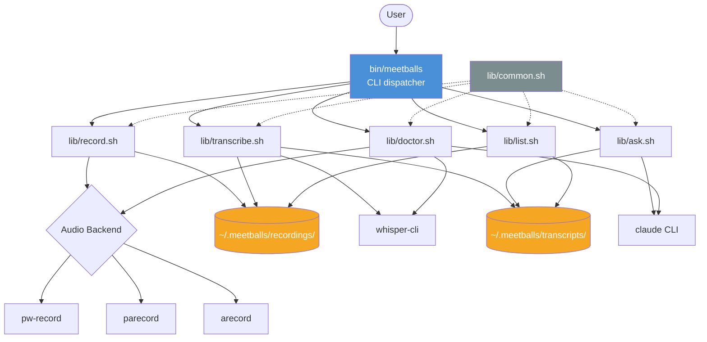
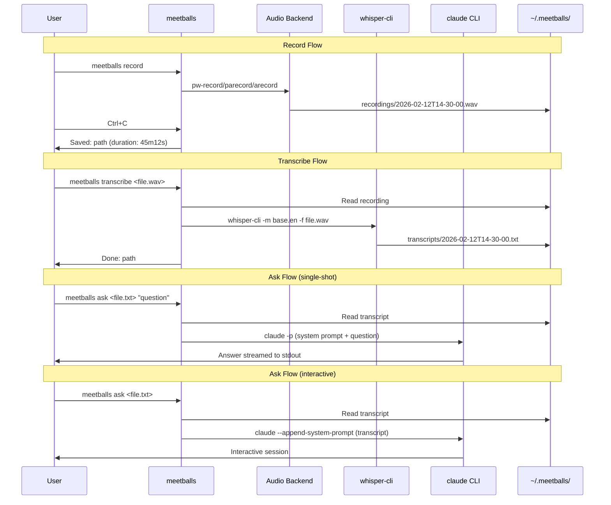

# MeetBalls — Design Document

## 1. Overview

### Problem
Meeting audio is lost because note-taking is distracting, recordings sit unwatched, and paid transcription services add cost and privacy concerns.

### Solution
MeetBalls is a bash CLI tool that records meeting audio, transcribes it offline with Whisper.cpp, and enables Q&A via Claude Code CLI. Everything runs locally — no paid services, no network calls for transcription.

### Key Design Decisions
- **WAV format at 16kHz mono 16-bit** — Whisper.cpp's preferred input; avoids format conversion
- **Audio backend priority: PipeWire > PulseAudio > ALSA** — modern-first, broadest WSL2 compatibility
- **Dual-mode ask**: single-shot with question (`claude -p`), interactive without (`claude --append-system-prompt`)
- **Whisper.cpp `base.en` model** — good accuracy/speed tradeoff for English meetings

## 2. Architecture Overview



### Data Flow



## 3. Components and Interfaces

### 3.1 `bin/meetballs` — CLI Dispatcher

Responsibilities:
- Parse top-level command and `--help`/`--version` flags
- Source `lib/common.sh` for shared utilities
- Dispatch to the appropriate `lib/*.sh` module
- Print global help if no command or unknown command given

Interface:
```
meetballs <command> [args...]
meetballs --help
meetballs --version
```

Implementation notes:
- Resolve `LIB_DIR` relative to the script's real path (follow symlinks via `readlink -f`)
- Use a `case` statement for dispatch — simple, fast, no framework needed

### 3.2 `lib/common.sh` — Shared Utilities

Sourced by all other modules. Provides:

| Function | Purpose |
|----------|---------|
| `mb_init` | Create `~/.meetballs/{recordings,transcripts}` if missing |
| `mb_info "msg"` | Print info message (no color prefix) |
| `mb_success "msg"` | Print green success message |
| `mb_warn "msg"` | Print yellow warning to stderr |
| `mb_error "msg"` | Print red error to stderr |
| `mb_die "msg"` | Print error and exit 1 |
| `mb_check_command "cmd"` | Check if command exists, return 0/1 |
| `mb_check_disk_space` | Warn if <500MB free on the partition containing `~/.meetballs` |
| `mb_detect_audio_backend` | Return the best available recorder command name |
| `mb_format_duration secs` | Format seconds as `Xh Ym Zs` (e.g., `45m12s`, `1h02m00s`) |
| `mb_recording_dir` | Echo `~/.meetballs/recordings` |
| `mb_transcript_dir` | Echo `~/.meetballs/transcripts` |
| `mb_timestamp` | Echo current ISO timestamp for filenames: `YYYY-MM-DDTHH-MM-SS` |

Constants:
```bash
MEETBALLS_DIR="${MEETBALLS_DIR:-$HOME/.meetballs}"
RECORDINGS_DIR="$MEETBALLS_DIR/recordings"
TRANSCRIPTS_DIR="$MEETBALLS_DIR/transcripts"
WHISPER_MODEL="${WHISPER_MODEL:-base.en}"
MIN_DISK_MB=500
```

The `MEETBALLS_DIR` env override enables testing with temp directories.

### 3.3 `lib/record.sh` — Recording

Entry function: `cmd_record "$@"`

Flow:
1. Parse `--help` → print usage and exit
2. Call `mb_init` to ensure directories exist
3. Call `mb_check_disk_space` → warn or abort
4. Call `mb_detect_audio_backend` → get recorder command, die if none found
5. Generate filename: `$(mb_timestamp).wav`
6. Set up SIGINT trap to stop recording gracefully
7. Print `Recording... (press Ctrl+C to stop)`
8. Start recorder in background, save PID
9. On SIGINT: kill recorder PID, wait, compute duration from WAV header
10. Print saved message with path and duration

Audio backend commands:
```bash
# PipeWire
pw-record --format=s16 --rate=16000 --channels=1 "$output_file"

# PulseAudio
parecord --format=s16le --rate=16000 --channels=1 "$output_file"

# ALSA
arecord -f S16_LE -r 16000 -c 1 -t wav "$output_file"
```

Duration extraction:
```bash
# From WAV file size and sample rate
# file_size = header(44) + samples * 2 bytes (16-bit)
# duration_secs = (file_size - 44) / (16000 * 2)
# Or use soxi/ffprobe if available, fallback to arithmetic
```

### 3.4 `lib/transcribe.sh` — Transcription

Entry function: `cmd_transcribe "$@"`

Flow:
1. Parse `--help` → print usage and exit
2. Validate argument: recording file path provided and file exists
3. Check `whisper-cli` is available → die with install instructions if not
4. Check whisper model is available → die with download instructions if not
5. Determine output path: same basename in `$TRANSCRIPTS_DIR`, `.wav` → `.txt`
6. Warn if recording >2 hours (check WAV duration)
7. Run whisper-cli with progress output
8. Print transcript path on completion

Whisper invocation:
```bash
whisper-cli \
  -m "$model_path" \
  -f "$recording_file" \
  --output-txt \
  --output-file "$transcript_base" \
  --print-progress
```

Model path detection:
- Check common locations: `~/.local/share/whisper.cpp/models/`, `/usr/local/share/whisper.cpp/models/`, `$WHISPER_CPP_MODEL_DIR`
- Look for `ggml-${WHISPER_MODEL}.bin`
- If not found, print download URL and instructions

### 3.5 `lib/ask.sh` — Claude Q&A

Entry function: `cmd_ask "$@"`

Flow:
1. Parse `--help` → print usage and exit
2. Validate argument: transcript file path provided and file exists
3. Check `claude` CLI available → die with install instructions if not
4. Read transcript content
5. Build system prompt with transcript embedded
6. If question argument provided → single-shot mode
7. If no question → interactive mode

System prompt template:
```
You are a meeting assistant. Answer questions based on the following meeting transcript.
Be concise and specific. If the answer isn't in the transcript, say so.

<transcript>
{transcript_content}
</transcript>
```

Single-shot mode:
```bash
claude -p "$question" --append-system-prompt "$system_prompt"
```

Interactive mode:
```bash
claude --append-system-prompt "$system_prompt"
```

Transcript size consideration:
- Claude Code CLI handles context internally, no chunking needed from our side
- For very large transcripts, the system prompt may be large — this is acceptable since Claude handles it

### 3.6 `lib/list.sh` — Listing

Entry function: `cmd_list "$@"`

Flow:
1. Parse `--help` → print usage and exit
2. Call `mb_init` to ensure directories exist
3. Scan `$RECORDINGS_DIR` for `.wav` files
4. For each file: extract duration, check transcript existence
5. Print formatted table

Output format:
```
RECORDING                      DURATION   TRANSCRIPT
2026-02-12T14-30-00.wav       45m12s     yes
2026-02-11T09-00-00.wav       1h02m00s   no
```

Duration extraction: same as record.sh (WAV header arithmetic or soxi/ffprobe).

If no recordings exist, print: `No recordings found in ~/.meetballs/recordings/`

### 3.7 `lib/doctor.sh` — Dependency Check

Entry function: `cmd_doctor "$@"`

Flow:
1. Parse `--help` → print usage and exit
2. Print `Checking dependencies...`
3. Run each check, collect pass/fail
4. Print results table
5. Exit 0 if all pass, 1 if any fail

Checks (in order):
| Check | How | OK message | FAIL message |
|-------|-----|------------|--------------|
| Audio backend | `mb_detect_audio_backend` | `OK (PipeWire)` / `OK (PulseAudio)` / `OK (ALSA)` | `MISSING — install pipewire, pulseaudio, or alsa-utils` |
| whisper-cli | `command -v whisper-cli` | `OK` | `MISSING — see https://github.com/ggerganov/whisper.cpp` |
| Whisper model | Check model file exists | `OK (model: base.en)` | `MISSING — run: whisper-cli -dl base.en` |
| claude | `command -v claude` | `OK (Claude Code CLI)` | `MISSING — see https://docs.anthropic.com/en/docs/claude-code` |
| Disk space | `df` check on `$MEETBALLS_DIR` | `OK (X.X GB free)` | `LOW — less than 500MB free` |

Output format:
```
Checking dependencies...
  audio:       OK (PipeWire)
  whisper-cli: OK
  model:       OK (base.en)
  claude:      OK (Claude Code CLI)
  disk space:  OK (12.4 GB free)
All checks passed.
```

## 4. Storage Layout

```
~/.meetballs/
├── recordings/
│   ├── 2026-02-12T14-30-00.wav
│   └── 2026-02-11T09-00-00.wav
└── transcripts/
    └── 2026-02-12T14-30-00.txt
```

- Recordings and transcripts are linked by basename (minus extension)
- No database, no config file for MVP — filesystem is the source of truth
- `MEETBALLS_DIR` env var allows overriding the base directory (for testing)

## 5. Error Handling

| Error | Where | Behavior |
|-------|-------|----------|
| No audio backend found | `record`, `doctor` | Die with install instructions listing all three options |
| No microphone / device error | `record` | Detect non-zero exit from recorder, print error with suggestions |
| Recording killed with SIGKILL | `record` | Partial WAV may be truncated — `transcribe` validates before processing |
| whisper-cli not found | `transcribe`, `doctor` | Die with install URL |
| Whisper model missing | `transcribe`, `doctor` | Die with download command |
| claude CLI not found | `ask`, `doctor` | Die with install URL |
| Transcript file not found | `ask` | Die with clear message |
| Recording file not found | `transcribe` | Die with clear message |
| Disk space < 500MB | `record`, `doctor` | Warning (record continues), reported in doctor |
| No recordings exist | `list` | Print informational message, exit 0 |
| Empty/silence transcript | `transcribe` | Write empty/minimal file, no error — success path |
| Recording > 2 hours | `transcribe` | Print warning about expected duration, proceed |

All errors go to stderr. All user-facing messages use colored output via `common.sh` helpers.

## 6. Testing Strategy

### Framework
- **bats-core** for bash testing
- **bats-support** and **bats-assert** helper libraries
- Tests in `tests/` directory, one file per module

### Test Environment
- All tests use `MEETBALLS_DIR=$(mktemp -d)` to isolate from real data
- External commands mocked via PATH manipulation (put mock scripts in a temp bin dir first in PATH)

### Unit Tests (`tests/test_common.sh`)
- `mb_format_duration` with various inputs (0s, 59s, 3600s, 7200s+)
- `mb_detect_audio_backend` with various commands available/missing
- `mb_check_disk_space` behavior
- `mb_timestamp` format validation
- Directory initialization

### Command Tests

**`tests/test_record.sh`**
- `--help` prints usage
- Errors when no audio backend found (mock all absent)
- Starts and stops recording gracefully (mock recorder that creates a WAV)
- Output file named correctly with timestamp
- Duration printed correctly

**`tests/test_transcribe.sh`**
- `--help` prints usage
- Errors on missing file argument
- Errors on nonexistent file
- Errors when whisper-cli missing
- Successful transcription creates .txt in transcripts dir (mock whisper-cli)
- Handles empty output gracefully

**`tests/test_ask.sh`**
- `--help` prints usage
- Errors on missing transcript argument
- Errors on nonexistent transcript file
- Errors when claude CLI missing
- Single-shot mode: calls `claude -p` with correct args (mock claude)
- Interactive mode: calls `claude --append-system-prompt` (mock claude)
- System prompt contains transcript content

**`tests/test_list.sh`**
- `--help` prints usage
- Empty recordings dir prints "no recordings" message
- Lists recordings with correct columns
- Shows "yes" for recordings with transcripts, "no" without

**`tests/test_doctor.sh`**
- `--help` prints usage
- All checks pass → exit 0, "All checks passed"
- Missing audio backend → exit 1, shows MISSING
- Missing whisper-cli → exit 1, shows MISSING
- Missing claude → exit 1, shows MISSING

### Integration Tests (when safe)
- Record 1 second of silence → verify WAV file created and has valid header
- Transcribe a known short WAV fixture → verify transcript created (requires whisper-cli)

## 7. `install.sh`

Responsibilities:
1. Check for bash >= 4.0
2. Install bats-core and helpers (git clone to `tests/libs/` if not present)
3. Create symlink: `~/.local/bin/meetballs` → `$(pwd)/bin/meetballs`
4. Ensure `~/.local/bin` is in PATH (print instructions if not)
5. Run `meetballs doctor` to report dependency status
6. Print next steps for any missing system dependencies

Does NOT install system packages (whisper-cli, audio backends) — that's the user's responsibility. `doctor` tells them what's missing.

## 8. Technology Choices

| Choice | Selected | Alternatives Considered | Rationale |
|--------|----------|------------------------|-----------|
| Language | Bash | Python, Rust | PROMPT.md mandates Bash-first; minimal deps |
| Audio format | WAV 16kHz/16-bit/mono | OGG | Whisper.cpp native format; no conversion step |
| Transcription | Whisper.cpp (`whisper-cli`) | Vosk, faster-whisper | Best accuracy/ecosystem, active development, single binary |
| Audio backend priority | PipeWire > PulseAudio > ALSA | Fixed to one | PipeWire is modern default; fallback chain maximizes compatibility |
| Whisper model | `base.en` default | tiny.en, small.en | Balance of speed and accuracy; English-only is fine per non-goals |
| Q&A | Claude Code CLI | Direct API | PROMPT.md mandates CLI; no API keys needed |
| Testing | bats-core | shunit2, bash TAP | Most popular bash test framework; good assertion library |
| Storage | Flat files | SQLite | KISS — filesystem is sufficient for MVP; basename linking is simple |

## 9. Appendix: Key Constraints and Limitations

- **WSL2 audio**: Requires PulseAudio or PipeWire bridge configured in WSL2. `doctor` will detect but can't fix this automatically.
- **Whisper.cpp compilation**: User may need to compile from source or find a pre-built binary. `doctor` checks availability.
- **Large transcript size**: Very long meetings produce large transcripts. Claude Code CLI handles context internally, but there may be practical limits. No chunking in MVP.
- **No concurrent recordings**: Only one `meetballs record` at a time. No locking mechanism — user's responsibility.
- **WAV file validation**: We use simple header arithmetic for duration. Corrupted/truncated WAVs may give wrong duration but won't crash.
