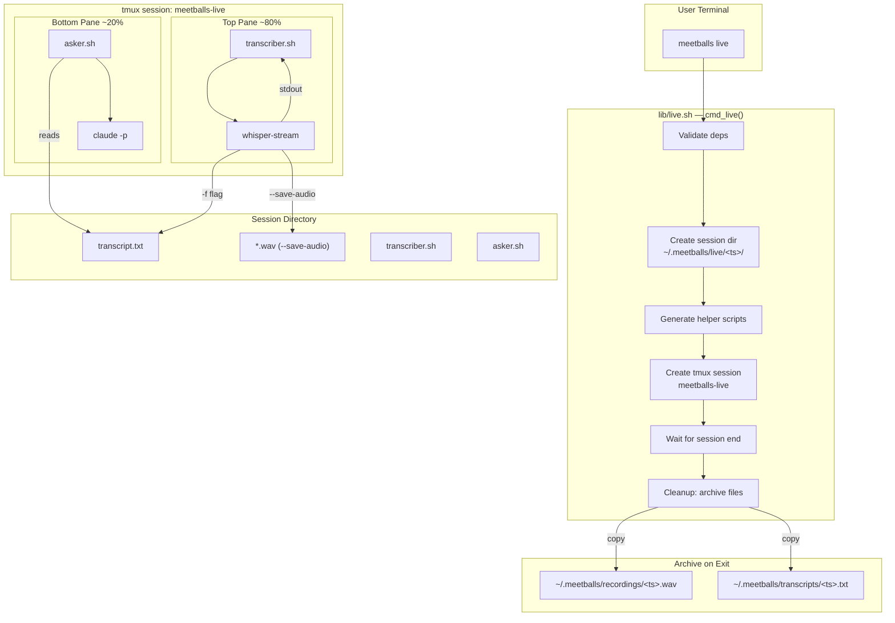
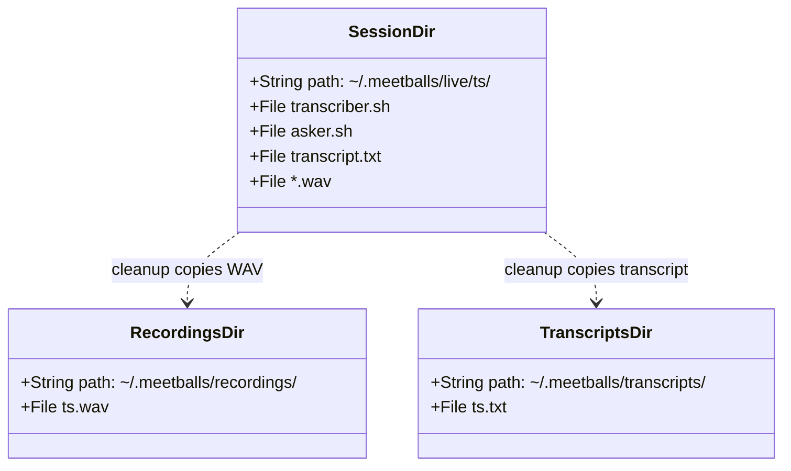

# MeetBalls Live — Design Document

## 1. Overview

### Problem
Meeting audio is lost because note-taking is distracting and recordings go unreviewed. Developers need real-time transcription with live Q&A during meetings — not after.

### Solution
`meetballs live` opens a tmux split-pane TUI: the top pane shows real-time transcription from `whisper-stream`, the bottom pane provides interactive Q&A against the growing transcript via Claude Code CLI. On exit, transcript and audio are saved to standard MeetBalls directories for later use with existing commands.

## 2. Detailed Requirements

See `specs/meetballs-live/requirements.md` for the full numbered requirements (R1–R12).

Key requirements summary:
1. Split-pane TUI via tmux (top: transcript, bottom: Q&A)
2. Real-time transcription via `whisper-stream` with `--save-audio`
3. Interactive Q&A via `claude -p` with transcript as system prompt
4. Clean exit handling with transcript + audio archival
5. Shared `mb_find_whisper_model()` helper (eliminates duplication)
6. Doctor checks for live-mode deps (separate from core deps)
7. No regressions — all 94 existing tests pass

## 3. Architecture Overview



## 4. Components and Interfaces

### 4.1 `lib/live.sh` — `cmd_live()`

Entry point for `meetballs live`. Orchestrates the entire session lifecycle.

**Public interface:**
```
cmd_live [--help]
```

**Internal flow:**

1. Parse args (only `--help` supported)
2. Validate dependencies: `tmux`, `whisper-stream`, `claude`, whisper model
3. Check disk space (warn, don't abort)
4. Kill stale `meetballs-live` tmux session if it exists
5. Create session directory: `$LIVE_DIR/$(mb_timestamp)`
6. Generate `transcriber.sh` and `asker.sh` in session dir
7. Create tmux session named `meetballs-live` with two panes
8. Attach to tmux session (blocks until user exits/detaches)
9. Run cleanup:
   - Copy transcript: `cp "$SESSION_DIR/transcript.txt" "$TRANSCRIPTS_DIR/$TIMESTAMP.txt"`
   - Copy audio WAV: `cp "$SESSION_DIR"/*.wav "$RECORDINGS_DIR/$TIMESTAMP.wav"` (glob matches the single WAV from `--save-audio`; the session dir `cd` ensures it's the only WAV there)
   - Print summary of saved paths
   - Remove session directory on success

**Dependency validation order:**
1. `tmux` — needed for TUI
2. `whisper-stream` — needed for transcription
3. `claude` — needed for Q&A
4. Whisper model — needed by whisper-stream

Each missing dep prints an actionable error and the function exits 1 on first failure.

### 4.2 Generated `transcriber.sh`

Written to `$SESSION_DIR/transcriber.sh`, executed in top tmux pane.

```bash
#!/usr/bin/env bash
cd "$SESSION_DIR"

echo "Starting live transcription... (Ctrl+C to stop)"
echo "Model: $WHISPER_MODEL"
echo "---"

whisper-stream \
    -m "$MODEL_PATH" \
    --step 3000 \
    --length 10000 \
    --no-timestamps \
    -f "$SESSION_DIR/transcript.txt" \
    --save-audio \
    -l en

# If whisper-stream exits (Ctrl+C or error), kill the tmux session
tmux kill-session -t meetballs-live 2>/dev/null
```

**Design decisions:**
- `cd "$SESSION_DIR"` so `--save-audio` writes WAV into the session dir
- `-f transcript.txt` appends transcribed text to the shared file
- On exit (any reason), kills the tmux session to trigger cleanup in the parent

### 4.3 Generated `asker.sh`

Written to `$SESSION_DIR/asker.sh`, executed in bottom tmux pane.

```bash
#!/usr/bin/env bash
TRANSCRIPT_FILE="$SESSION_DIR/transcript.txt"

echo "Meeting Q&A — type a question, or 'quit' to end session"
echo ""

while true; do
    printf "> "
    read -r question || break  # EOF = exit

    # Handle exit commands
    case "$question" in
        quit|exit) break ;;
        "") continue ;;
    esac

    # Read current transcript
    transcript=""
    if [[ -f "$TRANSCRIPT_FILE" ]]; then
        transcript=$(<"$TRANSCRIPT_FILE")
    fi

    if [[ -z "$transcript" ]]; then
        echo "(No transcript yet — keep talking!)"
        echo ""
        continue
    fi

    # Build system prompt and call Claude
    system_prompt="You are a meeting assistant. A meeting is in progress.
Answer questions based on the transcript so far.
Be concise and specific. If the answer isn't in the transcript, say so.

<transcript>
${transcript}
</transcript>"

    claude -p "$question" --append-system-prompt "$system_prompt"
    echo ""
done

# Kill tmux session on exit
tmux kill-session -t meetballs-live 2>/dev/null
```

**Design decisions:**
- No `local` keyword — this is a standalone script, not a function. Variables don't leak since it runs as a separate process.
- Reads the **entire** transcript file on each question (simple, no incremental parsing)
- Uses `claude -p` (single-shot mode) per question, not interactive mode, because the transcript changes between questions
- Empty input (just Enter) loops without calling Claude
- EOF (pipe closed) treated as exit

### 4.4 `lib/common.sh` — New additions

**New constant:**
```bash
LIVE_DIR="$MEETBALLS_DIR/live"
```

**New function: `mb_find_whisper_model()`**
```
mb_find_whisper_model
  Searches for ggml-${WHISPER_MODEL}.bin in standard paths.
  Prints absolute path to stdout on success.
  Returns 1 (no output) on failure.
```

Search paths (in order):
1. `$WHISPER_CPP_MODEL_DIR` (if set)
2. `$HOME/.local/share/whisper.cpp/models`
3. `/usr/local/share/whisper.cpp/models`

**Update `mb_init()`:** Also creates `$LIVE_DIR`.

### 4.5 `lib/doctor.sh` — Modified

Two-section output: **Core** and **Live mode**.

```
Checking dependencies...
  audio:          OK (PipeWire)
  whisper-cli:    OK
  model:          OK (base.en)
  claude:         OK (Claude Code CLI)
  disk space:     OK (42.3 GB free)

Live mode:
  tmux:           OK
  whisper-stream: OK
  libsdl2:        OK

All checks passed.
```

**Key behavior change:** Core failures cause exit 1. Live-mode failures are reported but do **not** cause exit 1 — they only print warnings. This ensures `meetballs record`, `transcribe`, `ask`, and `list` are unaffected by missing live-mode deps.

The live-mode failures are counted separately and reported in the summary:
- `All checks passed.` (0 core + 0 live failures)
- `All core checks passed. 2 live-mode check(s) failed.` (0 core + N live failures)
- `N check(s) failed.` (N core failures, regardless of live failures)

### 4.6 `lib/transcribe.sh` — Refactored

Replace lines 38–55 (inline model search) with:
```bash
local model_path
model_path=$(mb_find_whisper_model)
if [[ -z "$model_path" ]]; then
    mb_die "Whisper model not found (ggml-${WHISPER_MODEL}.bin). Download it with: whisper-cli -dl $WHISPER_MODEL"
fi
```

### 4.7 `bin/meetballs` — Modified

Add `live` command to dispatcher and help text:
```bash
live)
    shift
    source "$LIB_DIR/live.sh"
    cmd_live "$@"
    ;;
```

Help text adds `live` as the first command (it's the primary feature):
```
Commands:
  live         Start a live transcription session with Q&A
  record       Record meeting audio from the microphone
  transcribe   Transcribe a recording to text
  ask          Ask questions about a transcript
  list         List recordings and transcript status
  doctor       Check dependencies and system readiness
```

### 4.8 `install.sh` — Modified

Add a new step between bats install and symlink creation:

```
--- 2b. Build whisper-stream with SDL2 support ---
```

Steps:
1. Check if `whisper-stream` is already installed → skip if so
2. Check for `libsdl2-dev` (`dpkg -s libsdl2-dev`)
3. If missing, prompt: `libsdl2-dev not found. Install it? [Y/n]`
4. Locate whisper.cpp source dir (check `$WHISPER_CPP_DIR`, then common paths)
5. Rebuild with: `cmake -B build -DWHISPER_SDL2=ON && cmake --build build --target stream`
6. Copy `build/bin/stream` to `/usr/local/bin/whisper-stream`

If whisper.cpp source is not found, print instructions and skip (non-fatal).

## 5. Data Model

### Session Directory Layout

```
~/.meetballs/live/<timestamp>/
├── transcriber.sh          # Generated by cmd_live
├── asker.sh                # Generated by cmd_live
├── transcript.txt          # Written by whisper-stream -f flag (grows during session)
└── <YYYYMMDDhhmmss>.wav    # Written by whisper-stream --save-audio
```

### Archive Layout (post-cleanup)

```
~/.meetballs/
├── recordings/
│   └── <timestamp>.wav     # Copied from session dir, renamed to MeetBalls convention
├── transcripts/
│   └── <timestamp>.txt     # Copied from session dir
└── live/
    └── <timestamp>/        # Session dir (removed after successful cleanup)
```

**Timestamp format:** `YYYY-MM-DDTHH-MM-SS` (from `mb_timestamp()`)

### File Relationships



## 6. Error Handling

### Dependency Failures

| Missing Dep | Error Message | Exit Code |
|-------------|---------------|-----------|
| tmux | `tmux not found. Install: sudo apt install tmux` | 1 |
| whisper-stream | `whisper-stream not found. Run install.sh to build it, or see whisper.cpp docs.` | 1 |
| claude | `claude not found. Install Claude Code CLI from https://docs.anthropic.com/en/docs/claude-code` | 1 |
| Whisper model | `Whisper model not found (ggml-base.en.bin). Download: whisper-cli -dl base.en` | 1 |

All use `mb_die()` for consistent error formatting.

### Runtime Failures

| Scenario | Handling |
|----------|----------|
| No microphone | whisper-stream exits with error → transcriber kills tmux → cleanup runs |
| whisper-stream crashes | Same as above — exit triggers tmux session kill |
| Disk space low | `mb_check_disk_space()` warns before start, continues anyway |
| Stale tmux session | Killed silently before creating new one |
| Empty transcript on question | Asker prints "(No transcript yet — keep talking!)" |
| Ctrl+C in top pane | whisper-stream exits → transcriber kills session → cleanup |
| `quit` in bottom pane | Asker kills tmux session → cleanup |
| tmux detach (Ctrl+B D) | `tmux attach` returns → cleanup runs in parent process |

### Cleanup Resilience

Cleanup uses defensive patterns:
- Transcript: `[[ -f "$SESSION_DIR/transcript.txt" ]] && cp ...` with `|| true`
- Audio WAV: glob `"$SESSION_DIR"/*.wav` — whisper-stream `--save-audio` writes exactly one WAV (named `output_YYYYMMDDhhmmss.wav`) into the session dir (because `transcriber.sh` does `cd "$SESSION_DIR"`). The glob handles the opaque filename without hardcoding it.
- Prints what was saved (or "No transcript to save" / "No recording to save" if missing)
- Session directory is removed only after successful copy of both files

## 7. Testing Strategy

### New Test File: `tests/test_live.bats`

**Tests for `cmd_live`:**

| # | Test | Approach |
|---|------|----------|
| 1 | `--help` prints usage | Run cmd, assert output contains "Usage:" |
| 2 | Missing tmux exits 1 | No mock for tmux, assert failure + message |
| 3 | Missing whisper-stream exits 1 | Mock tmux, no whisper-stream mock |
| 4 | Missing claude exits 1 | Mock tmux + whisper-stream, no claude |
| 5 | Missing model exits 1 | Mock all commands, no model file |
| 6 | Session dir created | Mock all deps + tmux (no-op attach), check dir exists |
| 7 | Helper scripts generated | Same setup, check files in session dir |
| 8 | Stale session killed | Mock `tmux ls` to list existing session, verify `kill-session` called |

**Mocking strategy:**
- `tmux` mock that records commands but doesn't launch real sessions
- `whisper-stream` mock (exit 0)
- `claude` mock (exit 0)
- Create fake model file in test fixture dir

**Tests for refactored modules:**

| Module | What to Verify |
|--------|----------------|
| `common.sh` | `mb_find_whisper_model` returns correct path, returns empty on missing |
| `doctor.sh` | Live-mode section appears, core-only failures still exit 1 |
| `transcribe.sh` | Still works with refactored model finder (existing tests cover this) |

### Regression Safety

All existing 94 tests must continue to pass. The refactoring of model search into `mb_find_whisper_model()` is the main regression risk — mitigated by running the full test suite after the change.

## 8. Appendices

### A. Technology Choices

| Choice | Alternative Considered | Rationale |
|--------|----------------------|-----------|
| `whisper-stream --save-audio` | Parallel `parecord` | Simpler (one process), identical output format (16kHz mono 16-bit WAV) |
| `claude -p` per question | `claude` interactive mode | Transcript changes between questions; fresh context each time is correct |
| tmux split pane | Terminal multiplexer alternative (screen, zellij) | tmux is ubiquitous, already in spec, well-understood API |
| Generated shell scripts | In-process tmux send-keys | Scripts are debuggable, self-contained, easier to test |

### B. Key Constraints

- Bash-only (no Python, Node, etc.)
- No API keys or paid services
- Linux/WSL2 only (macOS out of scope)
- `claude` CLI = Claude Code (free), not Anthropic API
- whisper-stream requires SDL2 for mic capture
- Session transcript may grow large for 3+ hour meetings (acceptable for MVP)

### C. Implementation Order

Suggested task breakdown for the Builder phase:

1. **`mb_find_whisper_model()` in common.sh** + refactor doctor.sh and transcribe.sh to use it → run existing tests
2. **Doctor live-mode section** — add tmux, whisper-stream, libsdl2 checks with separate reporting
3. **`lib/live.sh`** — core feature: validation, session setup, script generation, tmux orchestration, cleanup
4. **`bin/meetballs` dispatcher** — add `live` command routing and help text
5. **`install.sh`** — add whisper-stream SDL2 build step
6. **`tests/test_live.bats`** — help, dependency validation, session setup tests
7. **Full regression run** — all tests pass
